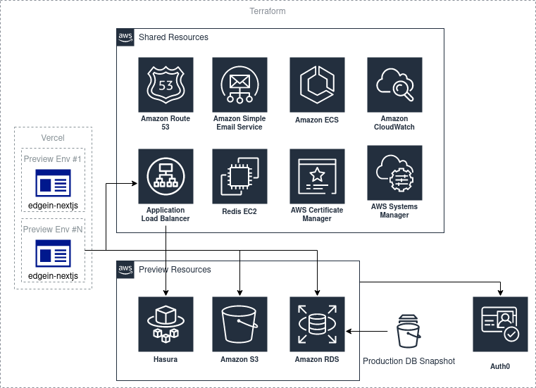

# Application



# Shared

Manage shared Terraform resources between workspaces.
Shared resources:

- ACM certificate for `nextjs-template.com` and `*.nextjs-template.com`

# How to use

All shared resources should be created in the `production` workspace.

Define project name for your terraform deployment - find all TODO in `infrastructure` directory

## Initialize S3-backend

```shell
cd s3-backend
terraform init
terraform workspace new production
terraform apply
```

## Create shared workspace

```shell
cd shared
terraform init
terraform workspace new production
terraform apply
```

## How to use setup new workspace

```shell
cd application
terraform init
terraform workspace new staging
# Setup docker registers
terraform apply --target=aws_ecr_repository.next_js --target=aws_ecr_repository.migration
```

Now, you can run the deployment workflow in GitHub.

# GitHub Actions Workflow

The workflow supports multiple environment configurations, logging levels, server resources adjustments, and running database migrations as required.

## Workflow Trigger

The workflow can be triggered manually (using the workflow dispatch event) or automatically when changes are pushed to the specified branch.

## Inputs

The workflow takes several inputs to customize the deployment process:

- **Workspace**: This specifies the workspace to deploy, and can be one of `testing`, `preview`, or `production`. The default is `preview`.
- **Migration**: This boolean value determines whether to run migrations during the deployment.
- **CPU**: This is the CPU setting for tasks in Fargate.
- **Memory**: This specifies the memory settings for tasks in Fargate.
- **Server Max Capacity**: This defines the limit for horizontal scaling of the NextJS server.
- **Log Level**: This defines the log level for the application and can be one of `trace`, `debug`, `info`, `warn`, `error`, or `fatal`. The default is `info`.
- **Project Name**: This is the project name, with a default value of `nextjs-template`.

## Environment Variables

The following environment variables are used in the workflow:

- AWS credentials (AWS_ACCESS_KEY_ID and AWS_SECRET_ACCESS_KEY)
- AWS region (AWS_REGION)
- Project name (PROJECT_NAME)
- Log level for the application (LOG_LEVEL)

**Do not forget to define all environment variables required during the NextJS build process (step 10)**

## Job Steps

The workflow consists of several steps that are executed sequentially:

1. **Checkout**: This checks out the code from the repository.
2. **Configure AWS Credentials**: This sets up AWS credentials using the environment variables.
3. **Setup Terraform**: This sets up Terraform for the job.
4. **Config Terraform plugin cache**: This configures the plugin cache for Terraform.
5. **Cache Terraform**: This caches Terraform to improve the execution speed.
6. **Terraform Init**: This initializes Terraform.
7. **ECR image tag**: This sets the ECR image tag.
8. **Set workspace**: This sets the workspace to use for deployment.
9. **Setup variables**: This sets up the variables for Terraform.
10. **Setup NextJS FE client variables**: This sets up the all ENV variables required in NextJS build process.
11. **Terraform Validate**: This validates the Terraform configuration.
12. **Terraform select workspace**: This selects the workspace in Terraform.
13. **Get NextJS and migration repositories**: This retrieves the NextJS and migration repositories.
14. **Set ECR repositories**: This sets the ECR repositories to be used.
15. **Login to Amazon ECR**: This logs into the Amazon ECR.
16. **Setup caching of Docker layers**: This sets up caching for Docker layers.
17. **Set up QEMU and Docker Buildx**: These steps set up the QEMU and Docker Buildx.
18. **Build, tag, and push NextJS and migration docker images to Amazon ECR**: These steps build, tag, and push the NextJS and migration Docker images to Amazon ECR.
19. **Stop NextJS server**: If migrations need to be run, the NextJS server is stopped.
20. **Update cluster state**: This updates the state of the cluster.
21. **Start NextJS server**: If migrations were run, the NextJS server is started.

## Set Workspace

In the `Set workspace` step, the workflow determines the environment to be used for the deployment based on the input provided in the `workspace` field. This environment could be `testing`, `preview`, or `production`.

The environment name is then set to the `WORKSPACE` environment variable, which is later used to select the appropriate Terraform workspace.

If the `workspace` input is set to `preview`, the workspace name will be the name of the current branch. This allows you to have a unique preview environment for each branch.

## Environments

The workflow supports three environments: `testing`, `preview`, and `production`.

- **Testing**: This is meant for general testing and can be used to validate changes before they're merged into the main codebase.
- **Preview**: This environment is intended for previewing changes in a live environment. By default, a new preview environment is created for each branch, allowing you to view changes specific to that branch. Note, however, that maintaining numerous preview environments can become expensive due to the resources used in each environment. Be sure to delete any unnecessary preview environments to manage costs.
- **Production**: This environment is used for the final live version of the application. Updates to the production environment should be performed manually and with care, as these changes will affect the live application.

## Manual Deployment to Production

The production environment is intended for the final, live version of your application. As such, deployments to this environment should be done manually. This is to ensure that changes pushed to the production environment are deliberate and well-reviewed to avoid unintentional disruptions or downtime.

Before deploying to the production environment, it's recommended to thoroughly test your changes in the testing and preview environments.

## Managing Costs with Preview Environments

While preview environments are incredibly useful for testing changes in a live, production-like environment, they can also lead to increased costs due to the resources used. AWS charges for the resources consumed, including CPU, memory, and storage, and these costs can add up if many preview environments are running simultaneously.

To manage costs, be sure to delete any preview environments that are no longer needed.

## Workflow Completion

Upon completion, your NextJS application will be deployed on AWS with the specified configuration. Please monitor the GitHub Actions console for any possible errors during the deployment.

Ensure you have properly set up the necessary secrets in your GitHub repository (AWS_ACCESS_KEY_ID and AWS_SECRET_ACCESS_KEY).

> Settings\Secrets and variables\Secrets

Ensure you have properly set up the necessary variables in your GitHub repository (AWS_REGION).

> Settings\Secrets and variables\Variables

If you are running migrations, ensure your migration scripts are correctly set up and that the migration docker image is properly built.

The server resources (CPU and memory settings) and server maximum capacity are adjusted as per the inputs provided. These resources directly impact the performance and cost of running your application on AWS, so choose the settings that best match your application's needs and your budget.

## Note

This workflow is designed for deployments using AWS and Terraform. Adjustments might be needed if you are using a different cloud provider or infrastructure as code tool.

## AWS ECS Environments vs Secrets

The AWS Elastic Container Service (ECS) uses environment variables and secrets to help you manage sensitive information, such as passwords and API keys. In our Terraform setup, we define these as two separate local variables: `ecr_environment` and `ecr_secrets` in file `application/ecs.tf`.

### Environment Variables (`ecr_environment`)

Environment variables in ECS tasks provide a way to pass configuration settings to your application. The `ecr_environment` local variable is an array of key-value pairs, where the `name` is the name of the environment variable and `value` is its value.

You can populate the `value` field in two ways:

1. Directly, with input Terraform variables (e.g., `var.server_log_level`), or
2. By referencing the value of an existing AWS resource (e.g., `aws_s3_bucket.resources.bucket` or ssm parameter `aws_ssm_parameter.db_url.value`).

### Adding a new Environment Variable

To add a new environment variable, append a new map to the `ecr_environment` array, specifying the `name` and `value`. For example:

```terraform
locals {
  ecr_environment = [
    ...,
    { name : "NEW_ENV_VAR", value : var.new_env_var }
  ]
}
```

In this case, `NEW_ENV_VAR` is the name of the new environment variable, and `var.new_env_var` is the Terraform variable that will be passed in when running `terraform apply`.

## Secrets (`ecr_secrets`)

Secrets in ECS tasks work similarly to environment variables, but they're specifically designed to handle sensitive information. AWS uses AWS Systems Manager Parameter Store to store and manage these secrets securely.

The `ecr_secrets` local variable is also an array of key-value pairs, where the `name` is the name of the secret, and `valueFrom` is an ARN that points to the secret in AWS Systems Manager Parameter Store.

### Adding a new Secret

To add a new secret, you first need to create a new parameter in the AWS Systems Manager Parameter Store. Then, you can append a new map to the `ecr_secrets` array, specifying the `name` and `valueFrom` (which should be the ARN of the new SSM parameter).

##### Creating a new SSM Parameter

To create a new SSM parameter, you would define it in the `infrastructure/application/ssm.tf` file. Here's an example:

```terraform
resource "aws_ssm_parameter" "new_secret" {
  name  = "${local.path}/app/new_secret"
  type  = "SecureString"
  value = var.new_secret_value
  description = "Description for the new secret"
}
```

In this case, `new_secret` is the name of the new secret, and `var.new_secret_value` is the Terraform variable that will be passed in when running `terraform apply`.

##### Referencing the new SSM Parameter

After creating the SSM parameter, you can add it to the `ecr_secrets` array:

```terraform
locals {
  ecr_secrets = [
    ...,
    { name : "NEW_SECRET", valueFrom : aws_ssm_parameter.new_secret.arn }
  ]
}
```

In this case, `NEW_SECRET` is the name of the new secret, and `aws_ssm_parameter.new_secret.arn` is the ARN of the SSM parameter you just created.

### Conclusion

In summary, while environment variables and secrets in ECS tasks serve similar purposes, secrets are specifically designed for handling sensitive data. By using Terraform, we can manage these settings in a declarative way, making our infrastructure easier to understand and maintain.